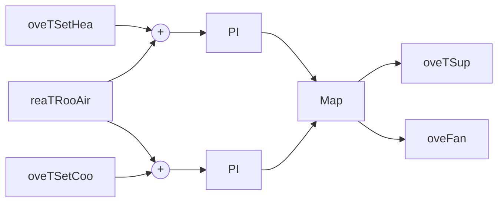
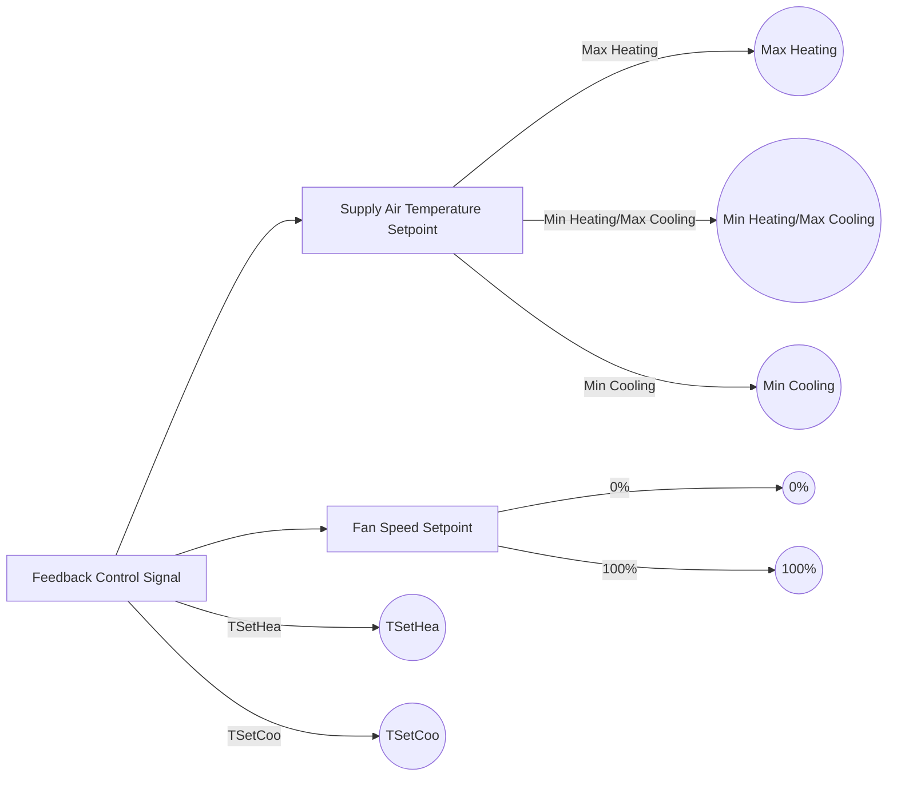

General model description.

## Building Design and Use

### Architecture

The building is a single room based on the BESTEST Case 900 model definition. The floor dimensions are 6m x 8m and the floor-to-ceiling height is 2.7m. There are four exterior walls facing the cardinal directions and a flat roof. The walls facing east-west have the short dimension. The south wall contains two windows, each 3m wide and 2m tall. The use of the building is assumed to be a two-person office with a light load density.

### Constructions

The constructions are based on the BESTEST Case 900 model definition. The exterior walls are made of concrete block and insulation, while the floor is a concrete slab. The roof is made of wood frame with insulation. The layer-by-layer specifications are (Outside to Inside):

#### Exterior Walls

| Name    | Thickness \[m] | Thermal Conductivity \[W/m-K] | Specific Heat Capacity \[J/kg-K] | Density \[kg/m3] |
| ------- | -------------- | ----------------------------- | -------------------------------- | ---------------- |
| Layer 1 | 0.009          | 0.140                         | 900                              | 530              |
| Layer 2 | 0.0615         | 0.040                         | 1400                             | 10               |
| Layer 3 | 0.100          | 0.510                         | 1000                             | 1400             |


| Name    | IR Emissivity \[-] | Solar Emissivity \[-] |
| ------- | ------------------ | --------------------- |
| Outside | 0.9                | 0.6                   |
| Inside  | 0.9                | 0.6                   |


#### Floor

| Name    | Thickness \[m] | Thermal Conductivity \[W/m-K] | Specific Heat Capacity \[J/kg-K] | Density \[kg/m3] |
| ------- | -------------- | ----------------------------- | -------------------------------- | ---------------- |
| Layer 1 | 1.007          | 0.040                         | 0                                | 0                |
| Layer 2 | 0.080          | 1.130                         | 1000                             | 1400             |


| Name    | IR Emissivity \[-] | Solar Emissivity \[-] |
| ------- | ------------------ | --------------------- |
| Outside | 0.9                | 0.6                   |
| Inside  | 0.9                | 0.6                   |


#### Roof

| Name    | Thickness \[m] | Thermal Conductivity \[W/m-K] | Specific Heat Capacity \[J/kg-K] | Density \[kg/m3] |
| ------- | -------------- | ----------------------------- | -------------------------------- | ---------------- |
| Layer 1 | 0.019          | 0.140                         | 900                              | 530              |
| Layer 2 | 0.1118         | 0.040                         | 840                              | 12               |
| Layer 3 | 0.010          | 0.160                         | 840                              | 950              |


| Name    | IR Emissivity \[-] | Solar Emissivity \[-] |
| ------- | ------------------ | --------------------- |
| Outside | 0.9                | 0.6                   |
| Inside  | 0.9                | 0.6                   |


The windows are double pane clear 3.175mm glass with 13mm air gap.

### Occupancy schedules

There is maximum occupancy (two people) from 8am to 6pm each day, and no occupancy during all other times.

### Internal loads and schedules
---


The internal heat gains from plug loads come mainly from computers and monitors. The internal heat gains from lighting come from hanging fluorescent fixtures. Both types of loads are at maximum during occupied periods and 0.1 maximum during all other times. The occupied heating and cooling temperature setpoints are 21 C and 24 C respectively, while the unoccupied heating and cooling temperature setpoints are 15 C and 30 C respectively.

## Climate data

The climate is assumed to be near Denver, CO, USA with a latitude and longitude of 39.76,-104.86. The climate data comes from the Denver-Stapleton,CO,USA,TMY.

## HVAC System Design

### Primary and secondary system designs

Heating and cooling is provided to the office using an idealized four-pipe fan coil unit (FCU), presented in Figure 1 below. The FCU contains a fan, cooling coil, heating coil, and filter. The fan draws room air into the unit, blows it over the coils and through the filter, and supplies the conditioned air back to the room. There is a variable speed drive serving the fan motor. The cooling coil is served by chilled water produced by a chiller and the heating coil is served by hot water produced by a gas boiler.

```mermaid
graph TD
    AF[AF] --> T
    T[T] --> G1
    G1[G1] --> CoolingCoil
    CoolingCoil[Cooling Coil] --> C2
    C2[C2] --> Zone
    HeatingCoil[Heating Coil] --> Zone
    Fan[Fan] --> Zone
    M[M] --> Fan
    T2[T] --> Zone
    
    subgraph Legend
        T3[T] --> |Temperature Sensor Point|
        M2[M] --> |Motor Control Point|
        C[Controller]
        AF2[AF] --> |Airflow Rate Sensor Point|
    end
```

Figure 1: System schematic.

### Equipment specifications and performance maps

For the fan, the design airflow rate is 0.55 kg/s and design pressure rise is 185 Pa. The fan and motor efficiencies are both constant at 0.7. The heat from the motor is added to the air stream. The COP of the chiller is assumed constant at 3.0. The efficiency of the gas boiler is assumed constant at 0.9.

### Rule-based or local-loop controllers (if included)
---


A baseline thermostat controller provides heating and cooling as necessary to the room by modulating the supply air temperature and fan speed. The thermostat, designated as C1 in Figure 1 and shown in Figure 2 below, uses two different PI controllers for heating and cooling, each taking the respective zone temperature set point and zone temperature measurement as inputs. The outputs are used to control supply air temperature set point and fan speed according to the map shown in Figure 3 below. The supply air temperature is exactly met by the coils using an ideal controller depicted as C2 in Figure 1. For heating, the maximum supply air temperature is 40 C and the minimum is the zone occupied heating temperature setpoint. For cooling, the minimum supply air temperature is 12 C and the maximum is the zone occupied cooling temperature setpoint.



Figure 2: Controller C1.



Figure 3: Mapping of PI output to supply air temperature set point and fan speed in controller C1.

## Model IO's

### Inputs

The model inputs are:

- con_oveTSetCoo_activate [1] [min=0, max=1]: Activation signal to overwrite input con_oveTSetCoo_u where 1 activates, 0 deactivates (default value)
- con_oveTSetCoo_u [K] [min=278.15, max=308.15]: Zone temperature setpoint for cooling
- con_oveTSetHea_activate [1] [min=0, max=1]: Activation signal to overwrite input con_oveTSetHea_u where 1 activates, 0 deactivates (default value)
- con_oveTSetHea_u [K] [min=278.15, max=308.15]: Zone temperature setpoint for heating
- fcu_oveFan_activate [1] [min=0, max=1]: Activation signal to overwrite input fcu_oveFan_u where 1 activates, 0 deactivates (default value)
- fcu_oveFan_u [1] [min=0.0, max=1.0]: Fan control signal as air mass flow rate normalized to the design air mass flow rate
- fcu_oveTSup_activate [1] [min=0, max=1]: Activation signal to overwrite input fcu_oveTSup_u where 1 activates, 0 deactivates (default value)
---


• fcu_oveTSup_u [K] [min=285.15, max=313.15]: Supply air temperature setpoint

## Outputs

The model outputs are:

• fcu_reaFloSup_y [kg/s] [min=None, max=None]: Supply air mass flow rate
• fcu_reaPCoo_y [W] [min=None, max=None]: Cooling electrical power consumption
• fcu_reaPFan_y [W] [min=None, max=None]: Supply fan electrical power consumption
• fcu_reaPHea_y [W] [min=None, max=None]: Heating thermal power consumption
• zon_reaCO2RooAir_y [ppm] [min=None, max=None]: Zone air CO2 concentration
• zon_reaPLig_y [W] [min=None, max=None]: Lighting power submeter
• zon_reaPPlu_y [W] [min=None, max=None]: Plug load power submeter
• zon_reaTRooAir_y [K] [min=None, max=None]: Zone air temperature
• zon_weaSta_reaWeaCeiHei_y [m] [min=None, max=None]: Cloud cover ceiling height measurement
• zon_weaSta_reaWeaCloTim_y [s] [min=None, max=None]: Day number with units of seconds
• zon_weaSta_reaWeaHDifHor_y [W/m2] [min=None, max=None]: Horizontal diffuse solar radiation measurement
• zon_weaSta_reaWeaHDirNor_y [W/m2] [min=None, max=None]: Direct normal radiation measurement
• zon_weaSta_reaWeaHGloHor_y [W/m2] [min=None, max=None]: Global horizontal solar irradiation measurement
• zon_weaSta_reaWeaHHorIR_y [W/m2] [min=None, max=None]: Horizontal infrared irradiation measurement
• zon_weaSta_reaWeaLat_y [rad] [min=None, max=None]: Latitude of the location
• zon_weaSta_reaWeaLon_y [rad] [min=None, max=None]: Longitude of the location
• zon_weaSta_reaWeaNOpa_y [1] [min=None, max=None]: Opaque sky cover measurement
• zon_weaSta_reaWeaNTot_y [1] [min=None, max=None]: Sky cover measurement
• zon_weaSta_reaWeaPAtm_y [Pa] [min=None, max=None]: Atmospheric pressure measurement
• zon_weaSta_reaWeaRelHum_y [1] [min=None, max=None]: Outside relative humidity measurement
• zon_weaSta_reaWeaSolAlt_y [rad] [min=None, max=None]: Solar altitude angle measurement
• zon_weaSta_reaWeaSolDec_y [rad] [min=None, max=None]: Solar declination angle measurement
• zon_weaSta_reaWeaSolHouAng_y [rad] [min=None, max=None]: Solar hour angle measurement
• zon_weaSta_reaWeaSolTim_y [s] [min=None, max=None]: Solar time
• zon_weaSta_reaWeaSolZen_y [rad] [min=None, max=None]: Solar zenith angle measurement
• zon_weaSta_reaWeaTBlaSky_y [K] [min=None, max=None]: Black-body sky temperature measurement
• zon_weaSta_reaWeaTDewPoi_y [K] [min=None, max=None]: Dew point temperature measurement
• zon_weaSta_reaWeaTDryBul_y [K] [min=None, max=None]: Outside drybulb temperature measurement
• zon_weaSta_reaWeaTWetBul_y [K] [min=None, max=None]: Wet bulb temperature measurement
• zon_weaSta_reaWeaWinDir_y [rad] [min=None, max=None]: Wind direction measurement
• zon_weaSta_reaWeaWinSpe_y [m/s] [min=None, max=None]: Wind speed measurement

## Forecasts

The model forecasts are:

• EmissionsElectricPower [kgCO2/kWh]: Kilograms of carbon dioxide to produce 1 kWh of electricity
• EmissionsGasPower [kgCO2/kWh]: Kilograms of carbon dioxide to produce 1 kWh thermal from gas
• HDifHor [W/m2]: Horizontal diffuse solar radiation
• HDirNor [W/m2]: Direct normal radiation
• HGloHor [W/m2]: Horizontal global radiation
• HHorIR [W/m2]: Horizontal infrared irradiation
• InternalGainsCon[1] [W]: Convective internal gains of zone
• InternalGainsLat[1] [W]: Latent internal gains of zone
• InternalGainsRad[1] [W]: Radiative internal gains of zone
• LowerSetp[1] [K]: Lower temperature set point for thermal comfort of zone
• Occupancy[1] [number of people]: Number of occupants of zone
• PriceElectricPowerConstant [($/Euro)/kWh]: Completely constant electricity price
• PriceElectricPowerDynamic [($/Euro)/kWh]: Electricity price for a day/night tariff
• PriceElectricPowerHighlyDynamic [($/Euro)/kWh]: Spot electricity price
---


- PriceGasPower [($/Euro)/kWh]: Price to produce 1 kWh thermal from gas
- TBlaSky [K]: Black Sky temperature
- TDewPoi [K]: Dew point temperature
- TDryBul [K]: Dry bulb temperature at ground level
- TWetBul [K]: Wet bulb temperature
- UpperCO2[1] [ppm]: Upper CO2 set point for indoor air quality of zone
- UpperSetp[1] [K]: Upper temperature set point for thermal comfort of zone
- ceiHei [m]: Ceiling height
- cloTim [s]: One-based day number in seconds
- lat [rad]: Latitude of the location
- lon [rad]: Longitude of the location
- nOpa [1]: Opaque sky cover [0, 1]
- nTot [1]: Total sky Cover [0, 1]
- pAtm [Pa]: Atmospheric pressure
- relHum [1]: Relative Humidity
- solAlt [rad]: Altitude angel
- solDec [rad]: Declination angle
- solHouAng [rad]: Solar hour angle.
- solTim [s]: Solar time
- solZen [rad]: Zenith angle
- winDir [rad]: Wind direction
- winSpe [m/s]: Wind speed

## Additional System Design

### Lighting

Artificial lighting is provided by hanging fluorescent fixtures.

### Shading

There are no shades on the building.

### Onsite Generation and Storage

There is no energy generation or storage on the site.

## Model Implementation Details

### Moist vs. dry air

A moist air model is used, but condensation is not modeled on the cooling coil and humidity is not monitored.

### Pressure-flow models

The FCU fan is speed-controlled and the resulting flow is calculated based on resulting pressure rise by the fan and fixed pressure drop of the system.

### Infiltration models

A constant infiltration flowrate is assumed to be 0.5 ACH.

### Other assumptions
---


The supply air temperature is directly specified.

CO2 generation is 0.0048 L/s per person (Table 5, Persily and De Jonge 2017) and density of CO2 assumed to be 1.8 kg/m^3, making CO2 generation 8.64e-6 kg/s per person. Outside air CO2 concentration is 400 ppm. However, CO2 concentration is not controlled for in the model.

Persily, A. and De Jonge, L. (2017). Carbon dioxide generation rates for building occupants. Indoor Air, 27, 868–879. https://doi.org/10.1111/ina.12383.

## Scenario Information

### Time Periods

The Peak Heat Day (specifier for /scenario API is 'peak_heat_day') period is:

This testing time period is a two-week test with one-week warmup period utilizing baseline control. The two-week period is centered on the day with the maximum 15-minute system heating load in the year.
Start Time: Day 334.
End Time: Day 348.

The Typical Heat Day (specifier for /scenario API is 'typical_heat_day') period is:

This testing time period is a two-week test with one-week warmup period utilizing baseline control. The two-week period is centered on the day with day with the maximum 15-minute system heating load that is closest from below to the median of all 15-minute maximum heating loads of all days in the year.
Start Time: Day 44.
End Time: Day 58.

The Peak Cool Day (specifier for /scenario API is 'peak_cool_day') period is:

This testing time period is a two-week test with one-week warmup period utilizing baseline control. The two-week period is centered on the day with the maximum 15-minute system cooling load in the year.
Start Time: Day 282.
End Time: Day 296.

The Typical Cool Day (specifier for /scenario API is 'typical_cool_day') period is:

This testing time period is a two-week test with one-week warmup period utilizing baseline control. The two-week period is centered on the day with day with the maximum 15-minute system cooling load that is closest from below to the median of all 15-minute maximum cooling loads of all days in the year.
Start Time: Day 146.
End Time: Day 160.

The Mix Day (specifier for /scenario API is 'mix_day') period is:

This testing time period is a two-week test with one-week warmup period utilizing baseline control. The two-week period is centered on the day with the maximimum sum of daily heating and cooling loads minus the difference between daily heating and cooling loads. This is a day with both significant heating and cooling loads.
Start Time: Day 14.
End Time: Day 28.

### Energy Pricing

The Constant Electricity Price (specifier for /scenario API is 'constant') profile is:

Based on the Schedule R tariff for winter season and summer season first 500 kWh as defined by the utility servicing the assumed location of the test case. It is $0.05461/kWh. For reference, see https://www.xcelenergy.com/company/rates_and_regulations/rates/rate_books in the section on Current Tariffs/Electric Rate Books (PDF).
Specifier for /scenario API is 'constant'.
---


The Dynamic Electricity Price (specifier for /scenario API is 'dynamic') profile is:

Based on the Schedule RE-TOU tariff as defined by the utility servicing the assumed location of the test case. For reference, see https://www.xcelenergy.com/company/rates_and_regulations/rates/rate_books in the section on Current Tariffs/Electric Rate Books (PDF).

- Summer on-peak is $0.13814/kWh.
- Summer mid-peak is $0.08420/kWh.
- Summer off-peak is $0.04440/kWh.
- Winter on-peak is $0.08880/kWh.
- Winter mid-peak is $0.05413/kWh.
- Winter off-peak is $0.04440/kWh.
- The Summer season is June 1 to September 30.
- The Winter season is October 1 to May 31.

The On-Peak Period is:
- Summer and Winter weekdays except Holidays, between 2:00 p.m. and 6:00 p.m. local time.

The Mid-Peak Period is:
- Summer and Winter weekdays except Holidays, between 9:00 a.m. and 2:00 p.m. and between 6:00 p.m. and 9:00 p.m. local time.
- Summer and Winter weekends and Holidays, between 9:00 a.m. and 9:00 p.m. local time.

The Off-Peak Period is:
- Summer and Winter daily, between 9:00 p.m. and 9:00 a.m. local time.

The Highly Dynamic Electricity Price (specifier for /scenario API is 'highly_dynamic') profile is:

Based on the the day-ahead energy prices (LMP) as determined in the Southwest Power Pool wholesale electricity market for node LAM345 in the year 2018. For reference, see https://marketplace.spp.org/pages/da-lmp-by-location#%2F2018.

The Gas Price profile is:
Based on the Schedule R tariff for usage price per therm as defined by the utility servicing the assumed location of the test case. It is $0.002878/kWh ($0.0844/therm). For reference, see https://www.xcelenergy.com/company/rates_and_regulations/rates/rate_books in the section on Summary of Gas Rates for 10/1/19.

## Emission Factors

The Electricity Emissions Factor profile is:

Based on the average electricity generation mix for CO,USA for the year of 2017. It is 0.6618 kgCO2/kWh (1459 lbsCO2/MWh). For reference, see https://www.eia.gov/electricity/state/colorado/.

The Gas Emissions Factor profile is:

Based on the kgCO2 emitted per amount of natural gas burned in terms of energy content. It is 0.18108 kgCO2/kWh (53.07 kgCO2/milBTU). For reference, see https://www.eia.gov/environment/emissions/co2_vol_mass.php.

## Weather Forecast Uncertainty: Temperature

Options for /scenario API are 'low', 'medium', or 'high'. Empty or None will lead to deterministic forecasts. See the BOPTEST design documentation for more information.

## Weather Forecast Uncertainty: Global Horizontal Irradiation (GHI)

Options for /scenario API are 'low', 'medium', or 'high'. Empty or None will lead to deterministic forecasts. See the BOPTEST design documentation for more information.