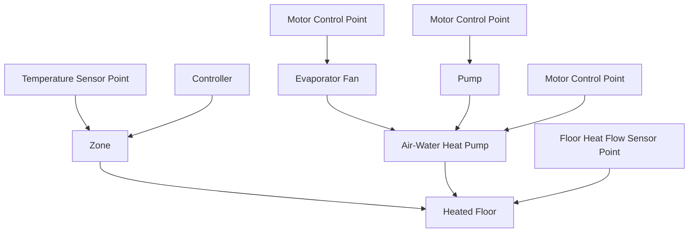
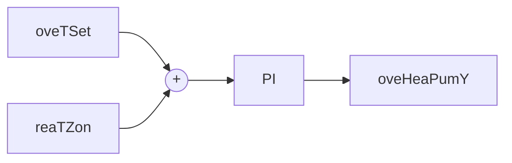

This is a single zone residential hydronic system model with an air-source heat pump and floor heating for WP 1.2 of IBPSA project 1.

## Building Design and Use

### Architecture

This model represents a simplified residential dwelling for a family of 5 members. The building envelope model is based on the BESTEST case 900 test case. The envelope model is therefore similar to the one used in IDEAS.Examples.IBPSA.SingleZoneResidentialHydronic but it is scaled to an area that is 4 times larger. Particularly, the model consists of a single zone with a rectangular floor plan of 12 by 16 meters and a height of 2.7 m. The internal wall mass is modelled using a single wall with a length that equals three times the building width plus two times the building length. This assumes that there are around 12 rooms in the building. The zone further consists of several south-oriented windows, which are modelled using a single window of 24 m2.

### Constructions

#### Exterior walls

The walls are modelled using IDEAS.Buildings.Components.OuterWall and consist of the following layers:

| Name                     | Thickness \[m] | Thermal Conductivity \[W/m-K] | Specific Heat Capacity \[J/kg-K] | Density \[kg/m3] |
| ------------------------ | -------------- | ----------------------------- | -------------------------------- | ---------------- |
| Layer 1 (wood siding)    | 0.009          | 0.14                          | 900                              | 530              |
| Layer 2 (insulation)     | 0.0615         | 0.04                          | 1400                             | 10               |
| Layer 3 (concrete block) | 0.1            | 0.51                          | 1000                             | 1400             |

#### Floor

The floor is modelled using IDEAS.Buildings.Components.SlabOnGround IDEAS.Buildings.Components.SlabOnGround and consists of the following layers:

| Name                 | Thickness \[m] | Thermal Conductivity \[W/m-K] | Specific Heat Capacity \[J/kg-K] | Density \[kg/m3] |
| -------------------- | -------------- | ----------------------------- | -------------------------------- | ---------------- |
| Layer 1 (concrete)   | 0.15           | 1.4                           | 840                              | 2100             |
| Layer 2 (insulation) | 0.20           | 0.02                          | 1470                             | 30               |
| Layer 3 (screed)     | 0.05           | 0.6                           | 840                              | 1100             |
| Layer 4 (tile)       | 0.01           | 1.4                           | 840                              | 2100             |

#### Roof

The roof is modelled using IDEAS.Buildings.Components.OuterWall and consist of the following layers:

| Name                    | Thickness \[m] | Thermal Conductivity \[W/m-K] | Specific Heat Capacity \[J/kg-K] | Density \[kg/m3] |
| ----------------------- | -------------- | ----------------------------- | -------------------------------- | ---------------- |
| Layer 1 (roof deck)     | 0.019          | 0.14                          | 900                              | 530              |
| Layer 2 (fiber glass)   | 0.1118         | 0.04                          | 840                              | 12               |
| Layer 3 (plaster board) | 0.01           | 0.16                          | 840                              | 950              |

### Occupancy schedules

The zone is occupied by 5 people before 7 am and after 8 pm each weekday and full time during weekends.

### Internal loads and schedules
---

There are no internal loads other than the occupants.

## Climate data

The model uses a climate file containing one year of weather data for Brussels, Belgium.

## HVAC System Design

### Primary and secondary system designs

An air-to-water modulating heat pump of 15 kW nominal heating capacity extracts energy from the ambient air to heat up the floor heating emission system, as shown in Figure 1 below. A fan blows ambient air through the heat pump evaporator when the heat pump is operating. The floor heating system injects heat between Layer 2 (insulation) and Layer 3 (screed), with water as working fluid. The floor heating pump has a nominal mass flow rate of 0.5 kg/s when the heat pump is working.

Figure 1: System schematic.

### Equipment specifications and performance maps

#### Heat pump

A water-to-air heat pump with a scroll compressor is used. The heat pump is modelled as described by:

H. Jin. Parameter estimation based models of water source heat pumps. PhD Thesis. Oklahoma State University. Stillwater, Oklahoma, USA. 2012.

with air instead of water blowing through the evaporator. Air condensation is therefore neglected. The model parameters are obtained by calibration of the heat pump model to manufacturer performance data following the procedure explained in this heat pump calibration guide using manufacturer performance data from a Carrier
---

air-to-water heat pump model 30AW015 which data can be found in this manufacturer datasheet.

For more information of the heat pump model we refer to the model documentation.

## Fluid movers

The floor heating system circulation pump has the default total efficiency of the pump model, which is 49 % at the time of writing (motor and hydraulic efficiencies are separately 70 % each). Also the fan that blows ambient air through the heat exchanger uses this default total efficiency of 49 %. The nominal mass flow rate of the floor heating circulation pump is of 0.5 kg/s and the nominal pressure rise of the heat pump evaporator fan is of 0.1 kPa.

## Rule-based or local-loop controllers (if included)

A baseline controller is implemented to procure comfort within the building zone. A PI controller is tuned with the zone operative temperature as the controlled variable and the heat pump modulation signal for compressor frequency as the control variable, as depicted as C1 in Figure 1 and shown in Figure 2 below. The control variable is limited between 0 and 1, and it is computed to drive the zone operative temperature towards the zone operative temperature setpoint. For baseline control, this setpoint is computed as the heating comfort setpoint plus an offset which varies depending on the occupancy schedule: during occupied periods the offset is set to only 0.2 degrees Celsius and is meant to avoid discomfort from slight oscilations around the setpoint; during unoccupied periods the offset is set to 5.5 degrees Celsius and is meant to compensate for the large temperature setback used during these periods. The latter offset prevents the need of abrubpt changes in the indoor temperature that may not be achievable because of the large thermal inertia of the floor heating system and which would consequently cause discomfort. All other equipment (fan for the heat pump evaporator circuit and floor heating emission system pump) are switched on when the heat pump is working (modulating signal higher than 0) and switched off otherwise. This is depicted as controller C2 in Figure 1.

Figure 2: Controller C1.

## Model IO's

### Inputs

The model inputs are:

- oveFan_activate [1] [min=0, max=1]: Activation signal to overwrite input oveFan_u where 1 activates, 0 deactivates (default value)
- oveFan_u [1] [min=0.0, max=1.0]: Integer signal to control the heat pump evaporator fan either on or off
- oveHeaPumY_activate [1] [min=0, max=1]: Activation signal to overwrite input oveHeaPumY_u where 1 activates, 0 deactivates (default value)
- oveHeaPumY_u [1] [min=0.0, max=1.0]: Heat pump modulating signal for compressor speed between 0 (not working) and 1 (working at maximum capacity)
- ovePum_activate [1] [min=0, max=1]: Activation signal to overwrite input ovePum_u where 1 activates, 0 deactivates (default value)
- ovePum_u [1] [min=0.0, max=1.0]: Integer signal to control the emission circuit pump either on or off
- oveTSet_activate [1] [min=0, max=1]: Activation signal to overwrite input oveTSet_u where 1 activates, 0 deactivates (default value)
- oveTSet_u [K] [min=278.15, max=308.15]: Zone operative temperature setpoint

### Outputs

The model outputs are:

- reaCO2RooAir_y [ppm] [min=None, max=None]: CO2 concentration in the zone
- reaCOP_y [1] [min=None, max=None]: Heat pump COP
- reaPFan_y [W] [min=None, max=None]: Electrical power of the heat pump evaporator fan
---

• reaPHeaPum_y [W] [min=None, max=None]: Heat pump electrical power
• reaPPumEmi_y [W] [min=None, max=None]: Emission circuit pump electrical power
• reaQFloHea_y [W] [min=None, max=None]: Floor heating thermal power released to the zone
• reaQHeaPumCon_y [W] [min=None, max=None]: Heat pump thermal power exchanged in the condenser
• reaQHeaPumEva_y [W] [min=None, max=None]: Heat pump thermal power exchanged in the evaporator
• reaTRet_y [K] [min=None, max=None]: Return water temperature from radiant floor
• reaTSetCoo_y [K] [min=None, max=None]: Zone operative temperature setpoint for cooling
• reaTSetHea_y [K] [min=None, max=None]: Zone operative temperature setpoint for heating
• reaTSup_y [K] [min=None, max=None]: Supply water temperature to radiant floor
• reaTZon_y [K] [min=None, max=None]: Zone operative temperature
• weaSta_reaWeaCeiHei_y [m] [min=None, max=None]: Cloud cover ceiling height measurement
• weaSta_reaWeaCloTim_y [s] [min=None, max=None]: Day number with units of seconds
• weaSta_reaWeaHDifHor_y [W/m2] [min=None, max=None]: Horizontal diffuse solar radiation measurement
• weaSta_reaWeaHDirNor_y [W/m2] [min=None, max=None]: Direct normal radiation measurement
• weaSta_reaWeaHGloHor_y [W/m2] [min=None, max=None]: Global horizontal solar irradiation measurement
• weaSta_reaWeaHHorIR_y [W/m2] [min=None, max=None]: Horizontal infrared irradiation measurement
• weaSta_reaWeaLat_y [rad] [min=None, max=None]: Latitude of the location
• weaSta_reaWeaLon_y [rad] [min=None, max=None]: Longitude of the location
• weaSta_reaWeaNOpa_y [1] [min=None, max=None]: Opaque sky cover measurement
• weaSta_reaWeaNTot_y [1] [min=None, max=None]: Sky cover measurement
• weaSta_reaWeaPAtm_y [Pa] [min=None, max=None]: Atmospheric pressure measurement
• weaSta_reaWeaRelHum_y [1] [min=None, max=None]: Outside relative humidity measurement
• weaSta_reaWeaSolAlt_y [rad] [min=None, max=None]: Solar altitude angle measurement
• weaSta_reaWeaSolDec_y [rad] [min=None, max=None]: Solar declination angle measurement
• weaSta_reaWeaSolHouAng_y [rad] [min=None, max=None]: Solar hour angle measurement
• weaSta_reaWeaSolTim_y [s] [min=None, max=None]: Solar time
• weaSta_reaWeaSolZen_y [rad] [min=None, max=None]: Solar zenith angle measurement
• weaSta_reaWeaTBlaSky_y [K] [min=None, max=None]: Black-body sky temperature measurement
• weaSta_reaWeaTDewPoi_y [K] [min=None, max=None]: Dew point temperature measurement
• weaSta_reaWeaTDryBul_y [K] [min=None, max=None]: Outside drybulb temperature measurement
• weaSta_reaWeaTWetBul_y [K] [min=None, max=None]: Wet bulb temperature measurement
• weaSta_reaWeaWinDir_y [rad] [min=None, max=None]: Wind direction measurement
• weaSta_reaWeaWinSpe_y [m/s] [min=None, max=None]: Wind speed measurement

## Forecasts

The model forecasts are:

• EmissionsElectricPower [kgCO2/kWh]: Kilograms of carbon dioxide to produce 1 kWh of electricity
• HDifHor [W/m2]: Horizontal diffuse solar radiation
• HDirNor [W/m2]: Direct normal radiation
• HGloHor [W/m2]: Horizontal global radiation
• HHorIR [W/m2]: Horizontal infrared irradiation
• InternalGainsCon[1] [W]: Convective internal gains of zone
• InternalGainsLat[1] [W]: Latent internal gains of zone
• InternalGainsRad[1] [W]: Radiative internal gains of zone
• LowerSetp[1] [K]: Lower temperature set point for thermal comfort of zone
• Occupancy[1] [number of people]: Number of occupants of zone
• PriceElectricPowerConstant [($/Euro)/kWh]: Completely constant electricity price
• PriceElectricPowerDynamic [($/Euro)/kWh]: Electricity price for a day/night tariff
• PriceElectricPowerHighlyDynamic [($/Euro)/kWh]: Spot electricity price
• TBlaSky [K]: Black Sky temperature
• TDewPoi [K]: Dew point temperature
• TDryBul [K]: Dry bulb temperature at ground level
• TWetBul [K]: Wet bulb temperature
• UpperCO2[1] [ppm]: Upper CO2 set point for indoor air quality of zone
---

- UpperSetp[1] [K]: Upper temperature set point for thermal comfort of zone
- ceiHei [m]: Ceiling height
- cloTim [s]: One-based day number in seconds
- lat [rad]: Latitude of the location
- lon [rad]: Longitude of the location
- nOpa [1]: Opaque sky cover [0, 1]
- nTot [1]: Total sky Cover [0, 1]
- pAtm [Pa]: Atmospheric pressure
- relHum [1]: Relative Humidity
- solAlt [rad]: Altitude angel
- solDec [rad]: Declination angle
- solHouAng [rad]: Solar hour angle.
- solTim [s]: Solar time
- solZen [rad]: Zenith angle
- winDir [rad]: Wind direction
- winSpe [m/s]: Wind speed

## Additional System Design

### Lighting

No lighting model is included.

### Shading

No shading model is included.

## Model Implementation Details

### Moist vs. dry air

The model uses moist air despite that no condensation is modelled in any of the used components.

### Pressure-flow models

A simple, single circulation loop is used to model the floor heating system as well as the air circulation through the heat pump evaporator.

### Infiltration models

Fixed air infiltration corresponding to an n50 value of 10 is modelled.

## Scenario Information

### Time Periods

The Peak Heat Day (specifier for /scenario API is 'peak_heat_day') period is:

This testing time period is a two-week test with one-week warmup period utilizing baseline control. The two-week period is centered on the day with the maximum 15-minute system heating load in the year.

Start Time: Day 16.

End Time: Day 30.
---

The Typical Heat Day (specifier for /scenario API is 'typical_heat_day') period is:

This testing time period is a two-week test with one-week warmup period utilizing baseline control. The two-week period is centered on the day with the maximum 15-minute system heating load that is closest from below to the median of all 15-minute maximum heating loads of all days in the year.

Start Time: Day 108.

End Time: Day 122.

## Energy Pricing

All pricing scenarios include the same constant value for transmission fees and taxes of each commodity. The used value is the typical price that household users pay for the network, taxes and levies, as calculated by Eurostat and obtained from: The energy prices and costs in Europe report. For the assumed location of the test case, this value is of 0.20 EUR/kWh for electricity.

The Constant Electricity Price (specifier for /scenario API is 'constant') profile is:

The constant electricity price scenario uses a constant price of 0.0535 EUR/kWh, as obtained from the "Easy Indexed" deal for electricity (normal rate) in https://www.energyprice.be/products-list/Engie (accessed on June 2020). Adding up the transmission fees and taxes, the final constant electricity price is of 0.2535 EUR/kWh.

The Dynamic Electricity Price (specifier for /scenario API is 'dynamic') profile is:

The dynamic electricity price scenario uses a dual rate of 0.0666 EUR/kWh during day time and 0.0383 EUR/kWh during night time, as obtained from the "Easy Indexed" deal for electricity (dual rate) in https://www.energyprice.be/products-list/Engie (accessed on June 2020). The on-peak daily period takes place between 7:00 a.m. and 10:00 p.m. The off-peak daily period takes place between 10:00 p.m. and 7:00 a.m. Adding up the transmission fees and taxes, the final dynamic electricity prices are of 0.2666 EUR/kWh during on-peak periods and of 0.2383 during off-peak periods.

The Highly Dynamic Electricity Price (specifier for /scenario API is 'highly_dynamic') profile is:

The highly dynamic electricity price scenario is based on the the Belgian day-ahead energy prices as determined by the BELPEX wholescale electricity market in the year 2019. Obtained from: https://my.elexys.be/MarketInformation/SpotBelpex.aspx. Notice that the same constant transmission fees and taxes of 0.20 EUR/kWh are added up on top of these prices.

## Emission Factors

The Electricity Emissions Factor profile is:

It is used a constant emission factor for electricity of 0.167 kgCO2/kWh, which is the grid electricity emission factor reported by the Association of Issuing Bodies (AIB) for year 2018. For reference, see: https://www.carbonfootprint.com/docs/2019_06_emissions_factors_sources_for_2019_electricity.pdf

## Weather Forecast Uncertainty: Temperature

Options for /scenario API are 'low', 'medium', or 'high'. Empty or None will lead to deterministic forecasts. See the BOPTEST design documentation for more information.

## Weather Forecast Uncertainty: Global Horizontal Irradiation (GHI)

Options for /scenario API are 'low', 'medium', or 'high'. Empty or None will lead to deterministic forecasts. See the BOPTEST design documentation for more information.